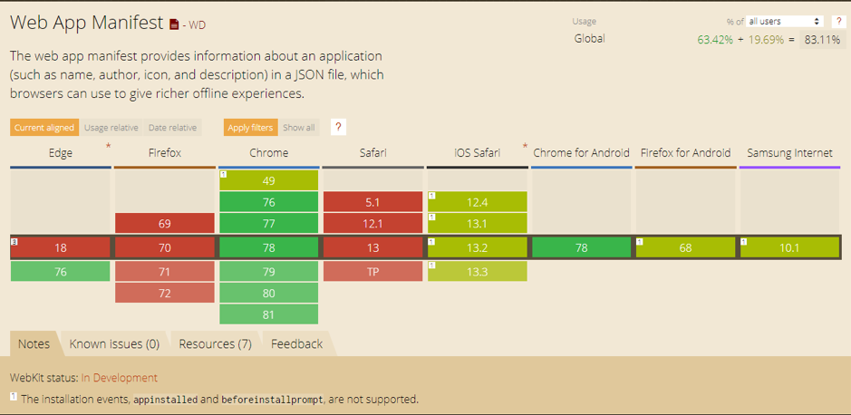

# Web App manifest

Het geven van een “native” look en feel aan de applicatie kan met web app manifest. Dit is een webmanifest-bestand dat informatie bevat die je browser gebruikt wanneer de applicatie op het startscherm mag worden geïnstalleerd. Als je een webapplicatie die geïnstalleerd is op je homescreen en je opent deze, dan opent deze zichzelf met een splash screen.

Je maakt in je project een webmanifest-bestand aan. Deze wordt meestal manifest.webmanifest genoemd. Dit bestand heeft dezelfde syntax als json. Hierin bepaal je wat eigenschappen over hoe je app zich moet gedragen. Deze laadt je vervolgens in de head van je browser.

```html
<head>
  <title>RoutiDo</title>
  <link rel="manifest" href="/manifest.webmanifest" />
  <!-- rest van de head... -->
</head>
```
Aan het web app manifest geef je de volgende eigenschappen mee:
- **Name** De name property geeft de naam van de applicatie aan. Deze wordt gebruikt op het splash screen en wordt weergegeven bij het schakelen tussen apps op android en IOS.

- **Short\_name**
Deze wordt gebruikt als naam onder het icoontje op android telefoons.

- **Start\_url**
Dit is de url waar je naartoe wordt genavigeerd als je de applicatie opent, vanaf je startscherm.

- **Background\_color**
De achtergrondkleur van het splash screen van je applicatie. Je vult hier de hex code voor de kleur die je wilt gebruiken.

- **Theme\_color**
 Met de theme\_color eigenschap geef je aan welke kleur statusbalk moet hebben als jouw applicatie wordt gebruikt. Ook wordt deze kleur gebruikt bij het als kleur voor de bovenste balk bij het schakelen tussen applicaties. Ook bij deze vul je de hex code voor de kleur die je wilt gebruiken.

- **Scope**
De scope waarin de web app manifest zich bevind. Als een pagina wordt geopend die buiten de scope valt zal deze worden geopend in de browser.

- **Display**
Met display geef je aan op welke manier hoe je applicatie wordt gepresenteerd. Je hebt hiervoor een aantal opties. Dit zijn fullscreen, standalone, minimal-ui en browser.

  Fullscreen zorgt ervoor dat de progressive web app in volledig scherm wordt geopend de browser, Deze heeft mist dan alle browser onderdelen, zoals de url. Ook wordt de statusbalk en de navigatieknoppen verborgen. Deze manier is vooral fijn als je een game maakt in Javascript.

  Standalone verbergt alleen de browser onderdelen zoals de URL-balk. Deze is gebruikelijk voor applicaties, omdat hiermee je webapplicatie het meeste op een native applicatie.

  Met Browser geef je aan dat je de applicatie gewoon als in de de browser wilt openen.

[afbeeldingen van versies]

Om te controleren in welke stand de browser is geopend kan het volgende if statement worden gebruikt:
  
  ```javascript
  If(window.matchMedia('(display-mode: standalone)').matches || window.navigator.standAlone) {
      // in this block the app is in standalone mode
  }
  ```
  
  ```css
  @media all and (display-mode: standalone) {
      /* Here goes the CSS rules that will only apply if app is running standalone */
  }
  
  ```

- **Dir**
hiermee geef je aan hoe de leesrichting aan van je applicatie. Dit is standaard &quot;ltr&quot; (left to right), maar dit kun je ook aanpassen naar &quot;rtl&quot; (right to left).

- **Orientation**
Hiermee dwing je met welke scherm oriëntatie de applicatie moet worden geopend. De opties die je kan aangeven zijn &quot;landscape&quot; en &quot;portrait&quot;. Als je niets aangeeft kun je de applicatie in beide standen gebruikt (als de it is ingesteld in android).

- **Icons**
In deze lijst geef je aan welke icoontjes er zijn voor de applicatie, zodat deze gebruikt kunnen worden voor het maken van een applicatie. Een icon bestaat uit de eigenschappen src, type en size. Src is de url van het icoon, type is het type afbeelding en size is de grootte van de afbeelding.

  ```json
  {
    "src": "/img/favicon/favicon192.png",
    "type": "image/png",
    "sizes": "192x192"
  }
  ```
  
  Je geeft over het algemeen meerdere icons aan in verschillende groottes. Het apparaat waarop de webapp dan wordt geïnstalleerd kiest dan zelf de beste grootte om te gebruiken als icoon. Echter wordt het wel aangeraden om een icoon te hebben van minsten 192 bij 192 pixels.
  
Uiteindelijk heb je een webmanifest-bestand wat er zo uitziet:
```json
{
  "name": "Routido",
  "short_name": "Routido",
  "theme_color": "#285f84",
  "background_color": "#285f84",
  "display": "standalone",
  "scope": "/",
  "start_url": "/",
  "icons": [
    {
      "src": "assets/icons/icon48.png",
      "sizes": "48x48",
      "type": "image/png"
    },
    {
      "src": "assets/icons/icon72.png",
      "sizes": "72x72",
      "type": "image/png"
    },
    {
      "src": "assets/icons/icon96.png",
      "sizes": "96x96",
      "type": "image/png"
    },
    {
      "src": "assets/icons/icon144.png",
      "sizes": "144x144",
      "type": "image/png"
    },
    {
      "src": "assets/icons/icon192.png",
      "sizes": "192x192",
      "type": "image/png"
    },
    {
      "src": "assets/icons/icon512.png",
      "sizes": "512x512",
      "type": "image/png"
    }
  ]
}

```
## Overige metatags

Niet alle browsers ondersteunen een web app manifest, maar bieden andere mogelijkheden voor het aanpassen van het icoontje of voor het aanpassen van de kleur van de statusbalk en de balk van de browser. Dit kunnen we bereiken door de meta tags toe te voegen aan de browser.

Zo kun je voor oudere versie van Safari voor IOS aangeven welke icoontjes gebruikt moeten worden. Dit kun je ook door voor Edge. Ook daar kan je aangeven welk icoon voor de tegel moet worden gebruikt en wat de achtergrondkleur moet zijn.

De volgende link-elementen kun je toevoegen aan de browser de native web app ook beschikbaar te krijgen op oudere browsers. Alles boven de witregel is voor Apple IOS en alles eronder is voor Microsoft Edge.


```html
<head>
    <meta charset="utf-8">
    <title>NgTodo</title>
    <base href="/">
    <link rel="stylesheet" href="https://stackpath.bootstrapcdn.com/bootstrap/4.3.1/css/bootstrap.min.css">
    <meta name="apple-mobile-web-app-capable" content="yes">
    <meta name="apple-mobule-web-app-status-bar-style" content="#285f84">
    <meta name="apple-mobule-web-app-title" content="Todo">
    <link rel="apple-touch-icon" href="/assets/icons/icon48.png" sizes="48x48">
    <link rel="apple-touch-icon" href="/assets/icons/icon72.png" sizes="72x72">
    <link rel="apple-touch-icon" href="/assets/icons/icon96.png" sizes="96x96">
    <link rel="apple-touch-icon" href="/assets/icons/icon144.png" sizes="144x144">
    <link rel="apple-touch-icon" href="/assets/icons/icon192.png" sizes="192x192">
    <link rel="apple-touch-icon" href="/assets/icons/icon512.png" sizes="512x512">
  
    <meta name="msapplication-TileImage" content="/assets/icon/icon144.png">
    <meta name="msapplication-TileColor" content="#285f84">
    <meta name="theme-color" content="#285f84">
    <meta name="viewport" content="width=device-width, initial-scale=1">
    <meta name="viewport" content="width=device-width, initial-scale=1">
    <link rel="icon" type="image/x-icon" href="/favicon.ico">
    <link href="https://fonts.googleapis.com/css?family=Roboto:300,400,500&amp;display=swap" rel="stylesheet">
    <link href="https://fonts.googleapis.com/icon?family=Material+Icons" rel="stylesheet">
    <link rel="manifest" href="/manifest.webmanifest">
    <meta name="theme-color" content="#285f84">
</head>
```

##browsersupport
Voor het installeren op het startscherm met behulp van een web app manifest is vooral aan mobiel gedacht. Dat zie je ook terug in het browsersupport. Op desktop wordt dit alleen ondersteund oor Google Chrome. 
Op mobiel werkt het echter wel op alle vijf de geteste browsers. Er zijn bij alle moderne browsers wel wat kleine onderdelen die niet werken. Zo wordt bijvoorbeeld in alle browser behalve Google Chrome het installed event niet uitgevoerd als de applicatie is geinstalleerd.



## web app manifest in dit project
Met behulp van de Angular-CLI kunnnen we van onze applicatie een Progressive web App maken. Om dit te doen moeten we het commando `ng add @angular/pwa` draaien in onze applicatie.

De Angular-CLI doet dan het volgende:
- voegt een manifest.webmanifest toe aan het project.
- voegt icons toe aan het project
- voegt de Web App manifest toe aan de index.html van het project
- voegt de ServiceWorkerModule toe aan de imports in de AppModules.

Het enige wat we nu nog moeten doen is de eigeschappen aanpassen in het Web App manifest de eigenschappen aanpassen. Ook moeten we de extra meta tags toevoegen aan de applicatie.
